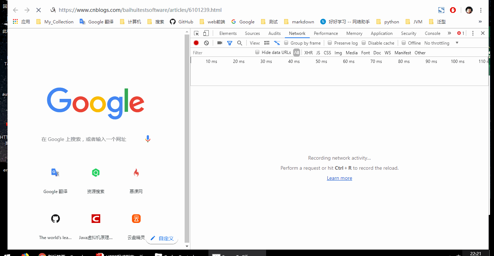

# Cache-Control


> ### 关于缓存

​	

* 为什么需要缓存？
  * 在服务器中有很多资源是静态资源，且更新周期长，不易发生改变，如页面头部，页面底部，导航栏，logo,js，css,图片等
  * 如果每个客户端，每次发送请求后 服务器都要把这些不易发生改变的数据也发送给客户端，这对<code>Http Server</code> 来说是一种压力，而且很多次数据传输的数据有很多重复的部分这对公司的网络出口带宽是浪费，最主要的是每次客户端都要接受这么多数据，有可能导致页面加载慢，影响上网体验
    * <code>Http Server</code> 压力
    * 网络带宽浪费
    * 客户端体验差
  * 把一些不易发生改变的资源，存起来，当相同的请求到达的时候，把服务器资源的副本返回给客户端，这就是缓存
  * 缓存分为，两种 一种是客户端缓存，一种是代理缓存，客户端缓存是私人的，代理缓存是面对很多客户端的


> ###  缓存的具体细节


```http
Expires: Fri, 01 Jan 1990 00:00:00 GMT
Cache-Controle : max-age=300
```


上面的<code>Expires</code> 是<code>HTTP/1.</code> 中的响应头，关于资源的过期时间的设置，该响应头的值是格林威治时间

<code>Cache-control</code> 是<code>HTTP/1.1</code> 中响应头，也是设置资源的过期时间的，但是指定的是相对时间，以秒为单位，

这两个都是设置资源的过期时间，只是单位不一样，但是不推荐使用<code>Expires</code>  响应头，这是因为，客户端的时间并不一定和服务器的时间绝对一致，而且在很多要求时间很严格的场景，如抢票，11.11 购物节下单的场景，对时间的要求很严苛的场景，绝对时间并不绝对，所以该响应头不推荐


当客户端浏览器，或者代理接收到的响应中有<code>Cache-Control</code> 或者<code>Expires</code> 的时候会对资源进行缓存


> ### Chrome 在资源有效时间内刷新





如上面的视频中<code>Chrome</code>开发者工具中对请求和响应的拦截，其中发起的第一个请求是<code>HTML</code> 的请求，在响应中

```http
cache-control: private, max-age=10
last-modified: Tue, 02 Jul 2019 14:32:00 GMT
```

设置了过期时间，按照<code>Http</code>  协议的要求，浏览器会缓存该请求对应的响应结果，在10秒内该资源都不会过期，但是，意外的是我在短短的时间内进行了刷新，发现浏览器还是会发起请求，

```http
Status Code: 200 	//如果使用了缓存，这里会显示从disk/memory 获取内容，而不是发起modified 验证
```

浏览器在刷新页面，会在请求中写入:

```http
cache-control: max-age=0
if-modified-since: Tue, 02 Jul 2019 14:31:57 GMT
```

也就是说浏览器会<code>强制</code>的发起请求去进行资源有效的<code>再验证</code> , 

如果当前页面停留超过了资源有效时间，进行刷新，Chrome 发起的请求还是资源有效性验证的请求


* 那么客户端是否真正按照<code>http</code> 协议的规定，进行缓存了呢？

  ​	在上面的视频中，不难发现，CSS,JS,PNG,GIF 等静态资源的确进行了缓存，当刷新页面的时候的确是从disk	中读取的


* 浏览器是否按照<code>http</code> 协议中的规定对该缓存的内容，进行缓存呢？ 即使资源是<code>HTML</code>


上面的视频中，我开了两个标签页，打开的都是相同的链接，就是为了验证浏览器是遵守<code>http</code> 协议，对该缓存的内容进行缓存，

首先在第一个页面中发起请求，然后在短时间内（以为html 资源设置的过期时间是10s），在另一个标签页中再打开相同的链接，我们会发现，在第二个标签页中的确是使用了缓存，<code>from disk cache</code> 


那么也就是说，如果你进行了刷新，无论是否超过了资源的有效时间，浏览器都会强制的发起<code>modified</code> 有效性再验证

