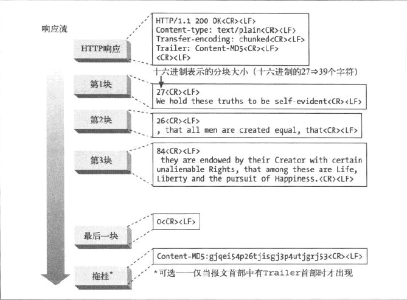

# Encoding-Type


> ### 传输编码


前面说了<code>Content-type</code> 的作用是为了标明响应正文的类型，是文本，多媒体，或者应用程序，还有字符的编码方式，这只是指定浏览器打开内容的方式，

为了压缩传输的数据量，服务器在发送数据前会根据发送请求的客户端在请求头中标注的可以接受的压缩类型

```http
Accept-Encoding:gzip,deflates
```


服务器会选择其中一种客户端可以接受的方式去压缩方式去压缩响应正文，但不包括响应头，响应头并不会被压缩，这种你能接受什么？我选择什么的方式，类似于协商，

<code>HTTP</code>中不止有关于数据的传输编码的协商

* ​	关于响应正文的压缩方式

  * ```http
    Accep-Ecoding:gzip,deflates			//请求头中描述客户端可接受的压缩方式
    ```

  * ```http
    Transfer-Ecoding:gzip/chunke/...	//响应正文中告诉客户端浏览器如何解码数据
    ```

    

* 关于分块传输中是否可以接受拖挂

  * ```http
    TE:gzip/Content-MD5					//请求头中声明可以接受响应中的拖挂类型,应用于分块传输中
    ```

  * ```http
    Trailer:Content-MD5					//在分块传输中声明，还有一个拖挂
    ```

    


*  还有文件类型的协商：

  * ```http
    Accept :image/webp,*/*			//请求头中告知服务器，本次请求可接受的响应的正文的数据类型
    ```

  * ```http
    Content-Type :text/html			//响应头中告知浏览器，本次响应的数据的类型
    ```

    


* 还有页面显示文字的语言：

  * ```http
    Access-Language:zh-CN,zh;q=0.8,zh-TW;	//请求头中告知服务器，我想要的数据显示在页面上以什么语言
    ```

  * ```http
    Content-Language:zh-CN	//响应头中会告诉客户端，本次响应数据显示的语言，但是很多国内的网站的响应中没有此响应头，默认中文简体
    ```


回到本节的重点，传输数据格式，

为什么压缩响应正文呢？

* 加快对客户端的响应速度
* 减少传输的数据量，减少带宽压力

一个相应报文可能很小，但是一个服务器一天接收到的请求是巨大的，每一个响应都压缩一点，对这个巨大的请求量的响应就会减少不少的数据传输,


##### 关于<code>Content-Length</code> ,响应正文的字节长度，是压缩后的字节长度，而不是未压缩后的字节长度


#### 还有一种传输方式：分块


为什么需要分块呢？

​	当请求的资源需要动态生成时，服务器无法一次性获资源压缩后的大小，所以需要分块传输，也就是说，在响	应头中，不会标记<code>Content-Length</code> 可以说是互斥的


分块传输如下：

​	

